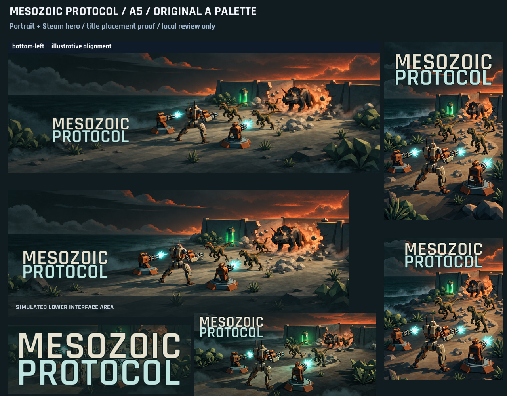
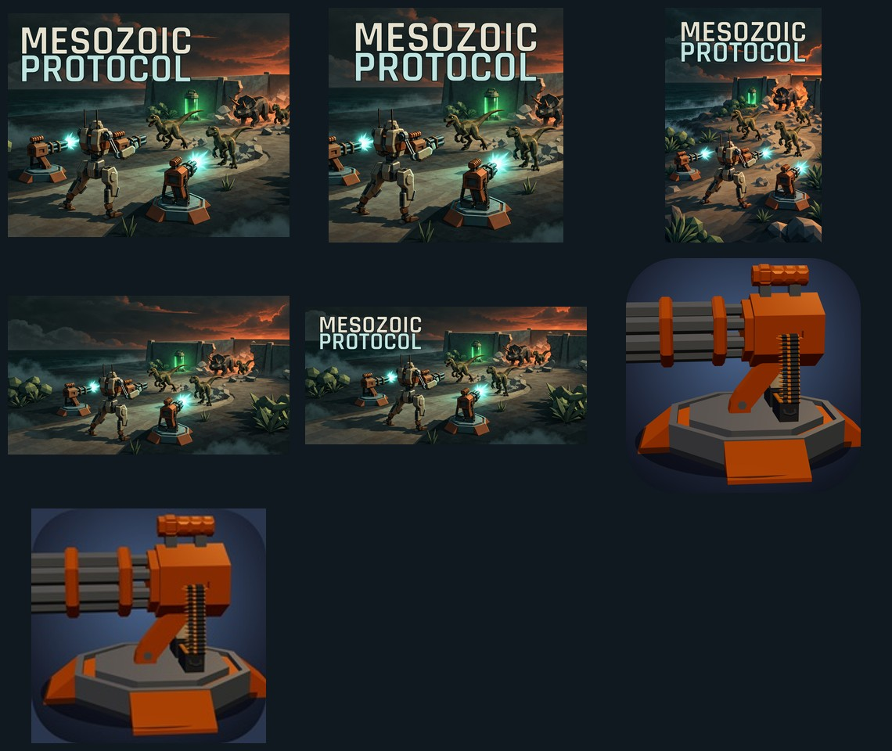

# Store asset library

**Start here.** [Current upload files](current/) · [Asset manifest](current/manifest.json) · [Assembly guide](WORKFLOW.md) · [Catalog](catalog.json)

The selected artwork is **A5 / original A palette**, approved on 30 September 2026. The earlier experiments remain archived. These files are outside `public/` so the upload package does not increase the shipped game's size.



## Files to use

| Store / purpose | Location | State as of 30 September 2026 |
| --- | --- | --- |
| Steam capsules, hero, transparent logo | [current/steam](current/steam/) | Eight approved exports. User completed uploads; Steam's store and library checklists pass. |
| Steam client icons | [current/steam/client](current/steam/client/) | New 512px transparent shortcut PNG and 184px app JPG; native Mac ICNS and original Linux ZIP. New exports have not been uploaded. |
| Desktop gameplay screenshots | [current/shared/gameplay-desktop](current/shared/gameplay-desktop/) | Eight historical captures. User deferred fresh screenshots until the game visual pass is ready. |
| Google Play icon and feature graphic | [current/google-play](current/google-play/) | Existing icon and earlier uploaded JPG retained. Use new `feature-graphic-a5.png` for the A5 replacement; not yet uploaded. |
| App Store icon | [current/app-store](current/app-store/) | Opaque 1024×1024 icon from the native asset catalog. Normally delivered in the app build. |
| Shared icon master / desktop icons | [current/shared](current/shared/) | Existing master, ICO and ICNS. Changes to these copies do not update the native projects. |
| Apple / Play mobile screenshots | Not yet approved | Capture tooling exists. Legacy [Play screenshots](google-play/) are reference only, not a validated phone/tablet set. |
| itch.io cover | [current/itch-io](current/itch-io/) | New A5 630×500 cover ready locally; does not claim to match the old upload. |
| Microsoft Store | [current/microsoft-store](current/microsoft-store/) | Square box art, portrait poster and text-free hero prepared. Confirm actual product slots and overlay previews when its listing exists. |
| Gameplay trailer | Capture deferred pending visual pass | No new footage or thumbnail created. Existing shot plan is in the project notes vault. |

`current/` is a committed upload snapshot, assembled by **copying** catalogued source files. It contains no generated replacement art. The manifest records dimensions, source paths, SHA-256 hashes, status and known gaps. A populated folder does not mean the store is published.

## New static pack



The preview reads left-to-right, top-to-bottom: itch cover, Microsoft box, Microsoft poster, Microsoft text-free hero, Play banner, Steam shortcut PNG, Steam app JPG. [Source exports and provenance](static-pack-2026-09-30/) · [Layout recipe](recipes/other-stores-layout.json).

| Upload file under `current/` | Slot | Pixels |
| --- | --- | --- |
| `itch-io/cover-630x500.png` | itch project cover | 630×500 |
| `microsoft-store/box-art-1080.png` | 1:1 box art | 1080×1080 |
| `microsoft-store/poster-art-720x1080.png` | 2:3 poster art | 720×1080 |
| `microsoft-store/super-hero-1920x1080.png` | Super hero art, no title | 1920×1080 |
| `google-play/feature-graphic-a5.png` | Play feature graphic | 1024×500 |
| `steam/client/shortcut-icon-512.png` | Steam shortcut icon | 512×512, transparent |
| `steam/client/app-icon-184.jpg` | Steam app icon | 184×184, opaque |
| `steam/client/mac-icon.icns` | Mac shortcut icon | Native ICNS bundle |

These are local exports, not store uploads or approved listing previews. Microsoft dimensions follow published MSIX guidance; MSI/EXE guidance specifies matching ratios. Microsoft may overlay the bottom third: the title and dinosaurs stay higher, but foreground mech/turret details can be obscured. Confirm the final console preview before using these candidates. The Microsoft hero is modestly upscaled from the 1678×937 landscape master. Steam client icons retain the native turret design; A5 artwork adapts the marketing scenes only.

## Steam drag-and-drop map

Drag the **eight PNGs at the top level of `current/steam/`** into Graphical Assets → “Drop images here to upload.” Do not drag the `client` subfolder or the manifest.

| File | Steam slot | Pixels |
| --- | --- | --- |
| header-capsule.png | Header Capsule | 920×430 |
| small-capsule.png | Small Capsule | 462×174 |
| main-capsule.png | Main Capsule | 1232×706 |
| vertical-capsule.png | Vertical Capsule | 748×896 |
| library-capsule.png | Library Capsule | 600×900 |
| library-header.png | Library Header | 920×430 |
| library-hero.png | Library Hero, no title | 3840×1240 |
| library-logo.png | Library Logo, transparent | 1280×441 |

Header Capsule and Library Header have identical dimensions and bytes but require **two separate assignments**. Use English as the base asset language. Save the library logo at the **bottom-left** anchor. The live Steam preview showed the title readable beside the central mech; a real client resize/parallax test remains separate. Steam reported the uploaded logo as 1280×720, while the retained local logo is 1280×441: the live upload bytes were not downloaded or compared, so their exact identity is unverified.

Steam app ID: `4798230`; store editor record: `1202837`. [Store editor](https://partner.steamgames.com/admin/game/edit/1202837?activetab=tab_graphicalassets&subtab=library). Client icons belong under Steamworks client images, not capsule slots. Upload/save, survey publication, store review, Coming Soon publication and game release are separate operations.

## Exploration and decisions

- [A / B / C contact sheet](artwork-selection-2026-09-30/selection-sheet.jpg), [original images](artwork-selection-2026-09-30/originals/) and [exact Flow prompts](artwork-selection-2026-09-30/flow-prompts.json).
- **A:** strongest palette and drama, initially too busy. **B:** preferred reference for future in-game visual work. **C:** least preferred.
- **A2:** cleaner landscape, too calm. **A3:** restored breach action.
- [A4](artwork-selection-2026-09-30/a4-steam/): established portrait/hero layouts, but its cobalt/yellow palette was rejected. Do not upload these exports.
- [A5](artwork-selection-2026-09-30/a5-original-palette/): approved layouts with A's charcoal/petrol teal, tan/rust, cyan-white weapon light and localized green tank glow. [Prompts](artwork-selection-2026-09-30/a5-original-palette/prompts.json), [masters](artwork-selection-2026-09-30/a5-original-palette/), [crop/alignment proofs](artwork-selection-2026-09-30/a5-original-palette/proofs/).
- [Production recipe](recipes/a5-layout.json), [portable export script](../../scripts/assemble-steam-artwork.mjs), [Rajdhani Bold and license](sources/fonts/).

The A5 hero was upscaled from 2170×725 to the required 3840×1240. The title is **typeset Rajdhani Bold**, not generated lettering. The scenes are AI-generated marketing art, not evidence of game graphics. AI use in Steam marketing was disclosed in the content survey on 30 September 2026.

## Maintain this package

```sh
pnpm assets:store        # copy the selected sources and write the manifest
pnpm assets:store:check  # read-only checks of copies, hashes, sizes and alpha
```

Edit the sources and `catalog.json`, then rebuild and review the diff. Never edit `current/` directly. Preserve an old approved package before selecting a new one. The checker rejects stale or extra files; remove superseded current copies explicitly after archiving them.

Historical listing notes under `steam/`, `google-play/` and `app-store/` are not authoritative status records. The current rollout audit lives in the separate notes vault: `projects/mesozoic-protocol/mesozoic-protocol-store-rollout-audit.md`. This repo owns the asset bytes, recipes, upload mappings and verification tools.
